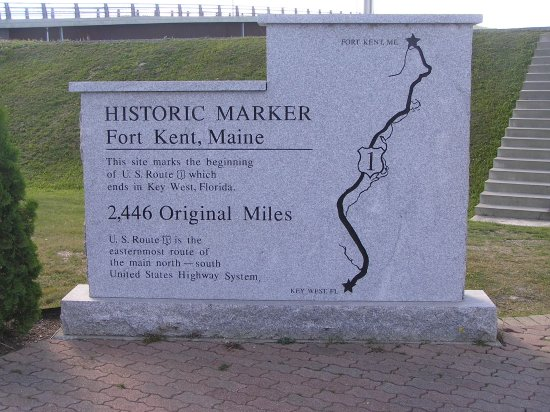

# Milestone Check-in #2

## Milestone Check-in with your Project Manager

The final push! You are almost there!

For your final project, here is a list of items you need to incoporate--many you might have already done, so check them off as completed.

- Build Tasks
  - [ ] A CMakeLists.txt which generates a makefile to create a:
    - [ ] Release version of your software
  - [ ] Run your code with the latest version of cppcheck
  - [ ] Run your code with the latest version of clang-tidy 

- Remaining Programming Tasks
  - [ ] Any remaining feature updates!
  
  
  
## Milestone ("Sprint") Check list

**Note** Everyone needs to speak at this meeting.

- [ ] TBD
