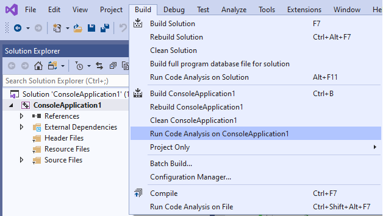

# Lab 9

> "C++ Code Smells"

For your lab today, you will work with your team, help each other setup a helpful refactoring tool, and then fix a few code smells in the ./src folder.

# Implementation Logistics

- You may use whatever operating system, IDE, or tools for completing this assignment.
	- However, my instructions will usually be using the command-line, and that is what I will most easily be able to assist you with.
- In the future there may be restrictions, so please review the logistics each time.

# Resources to help

Provided below are a list of curated resources to help you complete the tasks below. Consult them (read them, or do Ctrl+f for keywords) if you get stuck.

- Task 1
	1. Style Refactoring Tools
		- Clang-Tidy
			- https://clang.llvm.org/extra/clang-tidy/
				- Official Documentation
	 	- Obtaining clang-tidy can be done by downloading the binaries here:
			- http://releases.llvm.org/download.html
				- (Some IDEs may already have clang-tidy setup, but this is your safest bet.)
		- Clang-Tidy Visual Studio 2019
			- https://devblogs.microsoft.com/cppblog/code-analysis-with-clang-tidy-in-visual-studio/
		- Clang-Tidy CLion (Mac)
			- https://www.jetbrains.com/help/clion/clang-tidy-checks-support.html
		- Clang-Tidy Ubuntu
			- https://www.kdab.com/clang-tidy-part-1-modernize-source-code-using-c11c14/
		 
- Task 2
	1. Code Smells
		- Useful reading on code smells
			- https://wiki.c2.com/?CodeSmell
		- Jason Turners Talk on Code Smells
			- https://www.youtube.com/watch?v=nqfgOCU_Do4
		
# Task 0 - Find your team!

1. Find your teammates here! https://docs.google.com/spreadsheets/d/1f7dGzR-mdv25OnGrV68xKeJw2TQrD-_dpHCnDjbKOus/edit#gid=0
2. Create your team repository
	1. Introduce each other
	2. One person click the link
	3. Come up with a fun team name
	4. Now click here and all join the same team
		- https://classroom.github.com/g/zoX25Zba
		- (If someone is missing, send me an e-mail.)

# Task 1 - Style Refactoring Tools

## Clang-Tidy

[clang-tidy](https://clang.llvm.org/extra/clang-tidy/) is a static analysis tool that can automatically find code smells and many other dangers in your code. It even has a tool to help format(clang-format) your code so that it looks 'neat'. [clang-tidy](https://clang.llvm.org/extra/clang-tidy/) can perform many types of checks on your code (e.g. check for use of modern style C++ vs old style). [clang-tidy](https://clang.llvm.org/extra/clang-tidy/) is yet another static analysis tool that can do many of the things 'cppcheck' can do and more. Using both will help you write modern and good code.

`clang-tidy test.cpp -checks=-*,clang-analyzer-*,-clang-analyzer-cplusplus*`

The above will run an analysis on your code and provide recommendations for the test.cpp file.

There are more reporting options on the [clang-tidy page](https://clang.llvm.org/extra/clang-tidy/): 

1. Try this example in the terminal:  `clang-tidy test.cpp -checks="google-*"`
2. Another example simpilar to those provided in the documentation: `clang-tidy bad.cpp -checks=*,clang-analyzer*,clang-analyzer-cplusplus*`

**Note**: You may turn some checks off using the `-` sign.

### Your task

1. Work with your team to make sure everyone can setup clang-tidy on your respective system and run it on a .cpp file from your previous A2 assignment.
	- Submit a screenshot showing you have clang-tidy available in your IDE/command-line.
	- You can download clang-tidy binaries here: http://releases.llvm.org/download.html
		- Some tools like Visual Studio 2019 may already have clang-tidy setup! (In which case, commit a snapshot named [tidy.jpg](./tidy.jpg))
		- (Otherwise, you can run the tools through the command-line)

# Task 2 - Code Smells

We have seen previously that a code smell is a hint that your software development is going to be more difficult in the future. Now is your chance to practice, and get exposed to refactoring C++ by hand.

You are always welcome to continue using tools like:

1. [cppcheck](http://cppcheck.sourceforge.net/)
2. [clang-tidy](https://clang.llvm.org/extra/clang-tidy/)
3. Any additional code analyzers you like (In fact, you may consider adding these to your build process in the future!)

## Your Task

Refactor the following code snippets. 

1. [./src/smell1.cpp](./src/smell1.cpp)
2. [./src/smell2.cpp](./src/smell2.cpp)
3. [./src/smell3.cpp](./src/smell3.cpp)
4. [./src/smell4.cpp](./src/smell4.cpp)

**Note** The examples do compile, but are small and somewhat not meaningful intentionally (Refactoring lots of smells is not pragmatic). However, the art of refactoring these may expose you to some new things (i.e. algorithm) in C++ that are very elegant for programming.

## Testing

- Make sure you can run clang-tidy on your respective operating system or within your respective IDE.
- Make sure your code for Task 2 compiles and is refactored to avoid the smell discussed in class.

# Submission/Deliverables

- Task 0
	- Create your team repository and make sure everyone joins!
- Task 1
	- A screenshot of you using clang-tidy called [tidy.jpg](./tidy.jpg) on a source file in your A2 (You need not fix the issues on your A2 if any are reported)
- Task 2
	- Fix each of the code smells shown from today's lecture and commit them tot he repository
	
### Submission

- Commit all of your files to github, including any additional files you create.
- Do not commit any binary files unless told to do so.
- Do not commit any 'data' files generated when executing a binary.

# Rubric

You (and any partner(s)) will receive the same grade from a scale of 0-2. Both partners should commit the same code.

- 0 for no work completed by the deadline
- 1 for some work completed, but something is not working properly
- 2 for a completed lab (with possible 'going further' options completed)

# Going Further

An optional task(if any) that will reinforce your learning throughout the semester--this is not graded.

1. Watch the rest of Jason Turner's talk and learn more best practices!

# F.A.Q. (Instructor Anticipated Questions)

1. Q: `stddef.h not found?`
	- A Install clang. 
	- https://stackoverflow.com/questions/20587228/clang-error-stddef-file-not-found
	- Close your shell and open it again to make sure the shell refreshed.
2. Q: I can't find the header files:
	- A: `clang-tidy some_file_you_want_to_analyze.cpp -- -I/some/file/path/SFML/include`
	-    `            ^ file                            ^ checks  ^ Include path where SFML lives`
